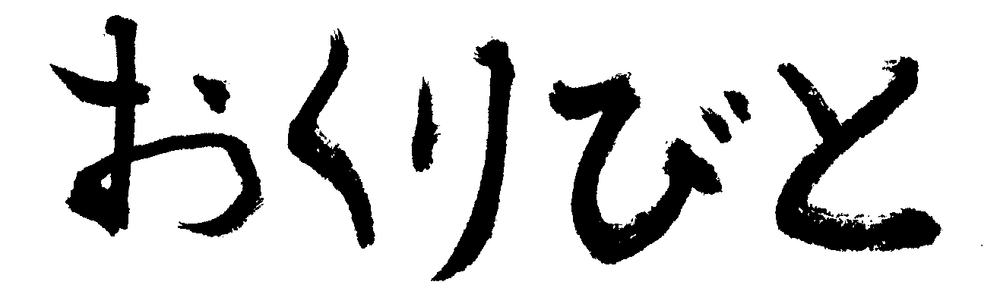

[](https://circleci.com/gh/muramurasan/okuribito/tree/master)

# Okuribito

https://rubygems.org/gems/okuribito



Okuribito is a gem to judge whether methods should be sent to the heaven :innocent:.

In other words, it can be used in order to extract the obsolete method.

Okuribito was named after a japanese movie.

## Installation

Add this line to your application's Gemfile:

```ruby
gem 'okuribito'
```

And then execute:

    $ bundle

Or install it yourself as:

    $ gem install okuribito

## Usage

Add `config/okuribito.yml` and edit it.

```yml
User:
  - '#feed'
Micropost:
  - '.from_users_followed_by'
```

By writing the following code to start the monitoring of the method.

```ruby
okuribito = Okuribito::OkuribitoPatch.new do |method_name, obj_name, caller_info|
  # TODO: do something as you like!
end
okuribito.apply("okuribito.yml")
```

You can also give the option.

`once_detect`: When it detects a method call, and run only once the code that has been set.

```ruby
okuribito = Okuribito::OkuribitoPatch.new(once_detect: true) do |method_name, obj_name, caller_info|
  # TODO: do something as you like!
end
okuribito.apply("okuribito.yml")
```

### ex: Ruby On Rails

Edit `application.rb`

```ruby
class OkuribitoSetting < Rails::Railtie
  config.after_initialize do
    okuribito = Okuribito::OkuribitoPatch.new do |method_name, obj_name, caller_info|
      # TODO: do something as you like!
    end
    okuribito.apply("okuribito.yml")
  end
end
```

## The smallest example

```ruby
require "bundler/setup"
require "okuribito"

class TestTarget
  def self.deprecated_self_method
  end

  def deprecated_method
  end
end

okuribito = Okuribito::OkuribitoPatch.new do |method_name, obj_name, caller_info|
  puts "#{obj_name} #{method_name} #{caller_info[0]}"
end
okuribito.apply("okuribito.yml")

TestTarget.deprecated_self_method
TestTarget.new.deprecated_method
```

Setting file:

```okuribito.yml
TestTarget:
  - ".deprecated_self_method"
  - "#deprecated_method"

```

Output:

```output
TestTarget deprecated_self_method example.rb:17:in `<main>'
#<TestTarget:0x007fd1e11ce368> deprecated_method example.rb:18:in `<main>'
```

## Callback examples

### Full stacktrace

```ruby
okuribito = Okuribito::OkuribitoPatch.new do |method_name, obj_name, caller_info|
  puts "#############################################################"
  puts "#{obj_name} #{method_name} #{caller_info[0]}"
  puts "#############################################################"
  puts caller_info
end
```

### Other ideas
- Send to Fluentd, TreasureData, Slack...

## License

The gem is available as open source under the terms of the [MIT License](http://opensource.org/licenses/MIT).

